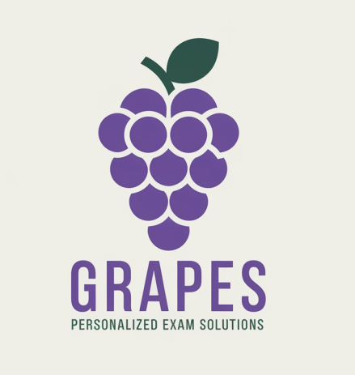

<!-- PROJECT HEADER -->
<h1>GRAPES &ndash; Graph-based AI for Personalized Exam Solutions</h1>

<!-- Project Icon -->

  

  <strong>GRAPES</strong> is an AI-driven platform designed to deliver personalized 
  and adaptive assessments for students in data-intensive fields. By combining 
  <strong>Graph Neural Networks (GNNs)</strong> with 
  <strong>Large Language Models (LLMs)</strong>, GRAPES ensures that exams, quizzes, 
  and practice exercises are aligned with each learner&rsquo;s unique skill gaps 
  and real-world industry needs.

<!-- TABLE OF CONTENTS -->
<h2 id="table-of-contents">Table of Contents</h2>

  <ul>
    <li><a href="#overview">Overview</a></li>
    <li><a href="#key-features">Key Features</a></li>
    <li><a href="#technical-architecture">Technical Architecture</a></li>
    <li><a href="#installation">Installation &amp; Setup</a></li>
    <li><a href="#usage">Usage</a></li>
    <li><a href="#contributing">Contributing</a></li>
    <li><a href="#license">License</a></li>
  </ul>

<!-- OVERVIEW -->
<h2 id="overview">Overview</h2>
<ul>
  <li><strong>Personalized Learning:</strong> Uses a Knowledge Graph that maps students,
      courses, assessments, and industry-relevant skills.</li>
  <li><strong>Dynamic Assessments:</strong> GNN-derived insights guide LLM-generated quizzes 
      and exams tailored to each learner&rsquo;s profile.</li>
  <li><strong>Real-Time Feedback:</strong> Provides instant recommendations for both students 
      and instructors, enabling continuous learning loops.</li>
</ul>

  <strong>Why GRAPES?</strong> 
  Conventional exam systems often fail to adapt to diverse student backgrounds and the 
  rapidly evolving demands of data science. GRAPES addresses this gap by linking 
  educational content, industry requirements, and personalized assessments in one 
  cohesive system.

<!-- KEY FEATURES -->
<h2 id="key-features">Key Features</h2>
<ol>
  <li><strong>Knowledge Graph Construction</strong> 
    Integrates data from LMS (e.g., Moodle), student performance records, and industry 
    standards. Maintains a dynamic graph in Neo4j for flexible querying and visualization.
  </li>
  <li><strong>Graph Neural Networks</strong> 
    Deploys GCN, GAT, and GraphSAGE to discover hidden patterns and recommend skill pathways. 
    Identifies specific skill gaps and feeds them forward to assessment modules.
  </li>
  <li><strong>LLM Integration</strong> 
    Uses Large Language Models (e.g., GPT-based architectures) for generating custom 
    exam questions and learning materials, employing Retrieval-Augmented Generation (RAG) 
    to ground LLM outputs in knowledge graph data.
  </li>
  <li><strong>Interactive Assessment Platform</strong> 
    React.js frontend for an engaging user experience, and a FastAPI backend with modular 
    APIs for data retrieval, model inference, and assessment creation.
  </li>
  <li><strong>Feedback &amp; Analytics</strong> 
    Offers real-time analytics on student progress, skill acquisitions, and user engagement. 
    Incorporates a feedback loop for iterative refinement of assessments and recommendations.
  </li>
</ol>

<!-- TECHNICAL ARCHITECTURE -->
<h2 id="technical-architecture">Technical Architecture</h2>
<pre>
          ┌─────────────────────┐          ┌────────────────────────┐
          │  Data Sources       │          │ Industry Skill Database│
          └─────────────┬───────┘          └─────────────┬─────────┘
                        │                                │
               ┌────────▼─────────┐                ┌──────▼──────┐
               │  Data Collection │                │ Graph Schema │
               │   & Preprocessing│                │  Definition  │
               └────────┬─────────┘                └──────┬──────┘
                        │                                │
               ┌────────▼─────────┐                ┌──────▼───────┐
               │  Neo4j Knowledge │                │Graph Neural   │
               │      Graph       │                │Networks (GNN) │
               └────────┬─────────┘                └──────┬────────┘
                        │                                │
               ┌────────▼─────────┐                ┌──────▼───────┐
               │  LLM Integration │                │ Recommendation│
               │ (RAG, GPT, etc.) │                │  Engine       │
               └────────┬─────────┘                └──────┬────────┘
                        │                                │
               ┌────────▼─────────┐          ┌───────────▼───────────┐
               │  FastAPI Backend │          │   React.js Frontend   │
               └──────────────────┘          └────────────────────────┘
</pre>

